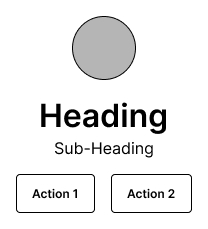

When I first discovered [Figma](https://figma.com/),
[the Auto Layout feature](https://help.figma.com/hc/en-us/articles/360040451373-Explore-auto-layout-properties)
was a pitiful imitation of the full power of
[CSS Flexbox](https://developer.mozilla.org/en-US/docs/Learn/CSS/CSS_layout/Flexbox).
Fortunately, this is no longer true, and Auto Layout has obtained more
or less the same amount of power that I get when building layouts in
code. However, despite the drastic increase in power, I still find
this to be a greatly underutilised feature, so I thought I would write
up some quick tips on how I think you should be using Auto Layout
better and more frequently.

### Tip 1: Group and move everything with auto-layout

The first tip is that you should simply be using Auto Layout a whole
lot more. Those Header links? Auto Layout. Typography? Probably Auto
Layout. Your whole page from top to bottom? Auto Layout.

Using Auto-Layout has numerous advantages.

First, your elements are much easier to rearrange this way. Just
select your element then press `shift + arrow key` to move its
position in the Auto Layout container.

Next, Auto Layout gives you much simpler control over padding. For
example, without Auto Layout we could make the button below by
manually dragging the inner text into place and then using the
constraints system to keep the text the right distance from the edge
of the button. This works, but is a faff. With Auto Layout, all we
need to do is enable Auto Layout on the parent Frame, set the desired
margin, then see everything magically fall into place.

<figcaption class='gatsby-resp-image-figcaption'>
  Implementing without Auto Layout
</figcaption>

<figcaption class='gatsby-resp-image-figcaption'>
  Implementing with Auto Layout
</figcaption>

Lastly, your spacing is consistent by default as Auto Layout children
must have the same gap between them. This adds a degree of visual
polish to your designs.

Event when you wish to have variable spacing between stacked elements,
this is also something you should be achieving with Auto Layout.

Consider the example of the layout below. We have a logo, heading,
sub-heading and two buttons.

You can break this down into three Auto Layout components like so,
with 16px spacing between the icon, text and actions (highlighted) and
tighter 4px spacing between the text. We also use a horizontal Auto
Layout frame to arrange the buttons.

### Tip 2: Rectangles Should Usually Be Auto Layout Frames

One big mistake that I used to make was using rectangles when I should
have been using frames with Auto Layout. Although you may be tempted
to use the rectangle tool and grouping to create rectangular
components, Auto Layout offers more resilient responsive designs (see
the first Button example above for a visualisation of creating such a
component with Auto Layout).

The exception to this is when you are creating more intricate shapes
where the ability to finely edit the rectangle's vector networks
(something that is not possible with frames) comes in handy.

### Tip 3: Use Shift+A

Honestly, this shortcut saves me so much time. Shift+A enables Auto
Layout for the currently selected Frame.
