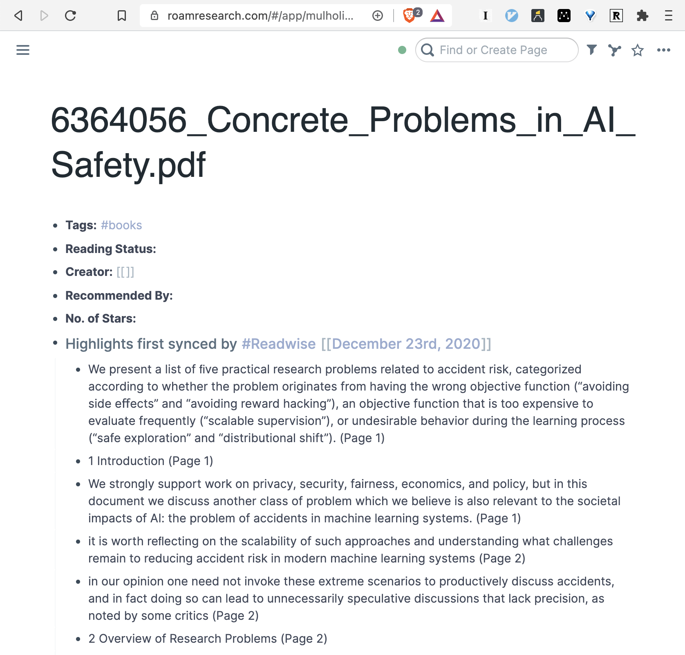

Do you have an ever-growing folder on your computer called something
like 'PDFs to read'? Me too.

One of the reasons I found this folder expanding in size was that I
was reluctant to consume information that I couldn't integrate
properly into my note-taking system in Roam. Fortunately, I've now
found a way to do just that.

Here's how you get highlighted PDFs into Roam with as little effort as
possible. FN, I'll be using Readwise to do this, so anyone else with
analogous workflows (e.g. Notion/Evernote users) should find what's
here pretty useful too.

## 1. Setup Roam and Readwise

We'll be using Readwise to sync our highlights to Roam so I'll be
assuming you have Roam and Readwise accounts setup. If you don't yet
have a Readwise account, sign up for one at https://readwise.io/ then
make sure you enable the Roam integration
([Nat Eliason has a good video guide here](https://www.youtube.com/watch?v=PLM1GGJa5KM)
or there's also some
[Readwise docs on the subject](https://help.readwise.io/article/71-how-does-the-readwise-to-roam-export-integration-work)).

## 2. Setup a PDF Inbox

I also sync this folder in Dropbox so that it's available across
devices and for reading on my phone via PDF Expert.

Now, whenever you find a PDF you want to read, save it to this folder.
I haven't got a great naming convention yet, but I tend to stick with
minimally informative titles where I can and use Roam metadata to fill
in the rest. e.g. for an academic paper, I'll put the title in but
avoid publication year or author names.

I also have a [textexpander](https://textexpander.com/) snippet setup
to generate a UUID for me (e.g. 37585405) so I can put this in the
title and make things super searchable. This is particularly valuable
when viewing something in Roam and then jumping back to view the
original source material in your filesystem.

With your accounts setup, the first thing you'll need is a simple
folder on your computer somewhere. Mine's called 'PDF Inbox' and sits
in my Favourites bar for easy access.

## 3. Read

When the time comes to do some reading, jump into this folder and open
your chosen PDF. I like to use PDF Expert as it has **by far** the
best feature set I've found but Preview, any other PDF reader, or even
a web browser also work fine (but do make sure you can highlight).

When you read, highlight any interesting segments. I follow Tiago
Forte's
['Progressive Summarisation' advice](https://fortelabs.co/blog/progressive-summarization-a-practical-technique-for-designing-discoverable-notes/)
when choosing what to highlight. Also feel free to add annotations if
your app supports that.

## 4. Export

When you've finished reading, you'll need to do a quick export to
Readwise. When using PDF Expert and Spark, I do this by clicking the
share menu and sending as a document to add@readwise.io. You can also
just email a file to that address manually, or use the web dashboard
at https://readwise.io/import/pdf.

You should get a conformation email and link to a Readwise page that
looks a little like this.

Now, if you Roam ↔ Readwise sync is all setup properly, you should
have a fresh Roam page full of highlights to view!

## 5. Refine in Roam (Optional)

If you want to go ahead and add extra detail, now is the time. You may
want to tag, clean up formatting, add heading structure, and
highlight.
