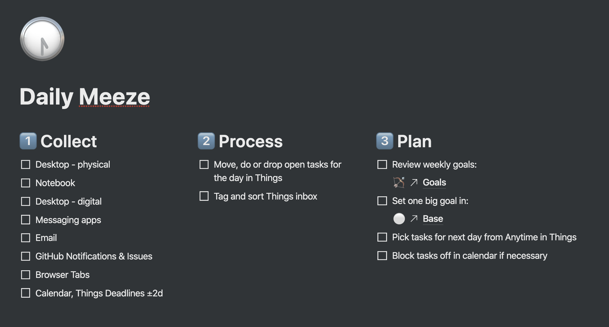
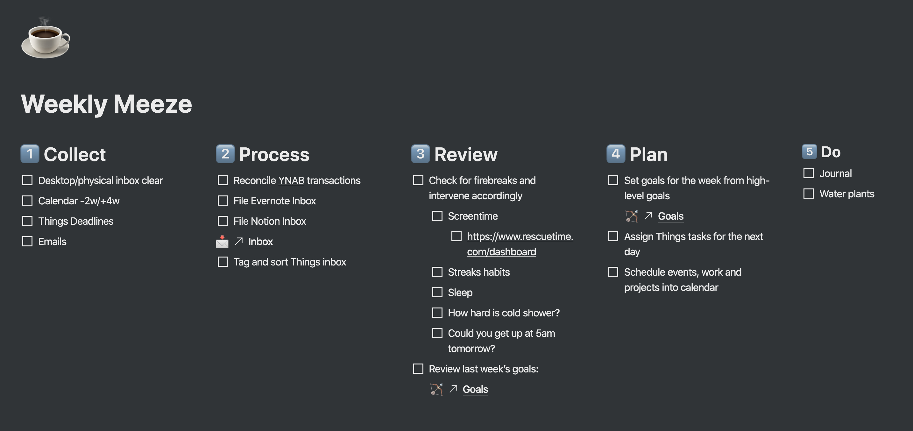
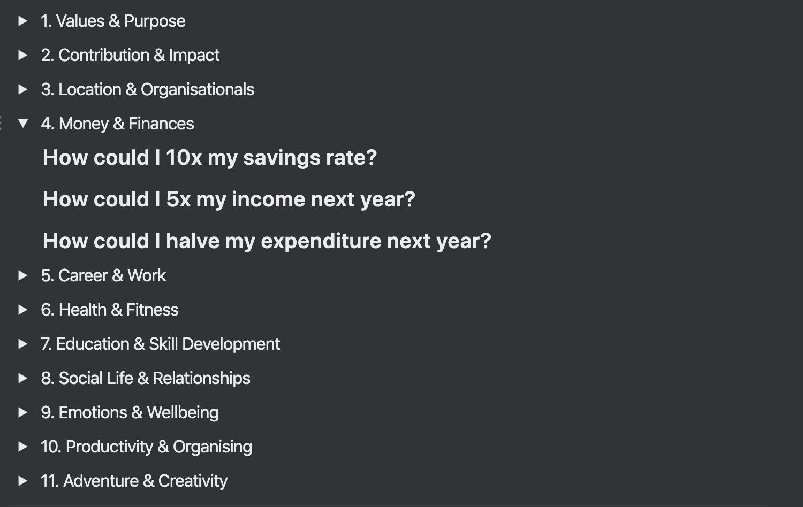

After finding so many similar posts useful [^1], I wanted to document
and share my personal productivity system.

I call it the ‘cascading system’ as you can picture it as a
multi-tiered waterfall, each level flowing down inform the one below
it.

That said, the experience of using the system is more bottom-up and I
find it helpful not only to define high-level goals and to work
backwards from there but also to focus on the habit of doing first and
then course correcting as appropriate. This means that I’ll be working
from the most granular level upwards, explaining each new level as it
naturally comes up from the one below it.

## Table of Contents

- [Daily Meeze](#daily-meeze)
- [Weekly Meeze](#weekly-meeze)
- [Quarterly Meeze](#quarterly-meeze)
- [Annual Meeze](#quarterly-meeze)

## Daily Meeze

At 18:00 on a typical workday, I do what I call the Daily Meeze[^2]
which takes the form of a checklist in Notion that looks like this:

I roughly follow the
[Getting Things Done methodology](https://gettingthingsdone.com/)
which was the inspiration for the three stages: Collect, Process and
Plan.

The Collect stage cleans out all my information sources and adds all
actions to my task manager inbox (for me,
[Things](https://culturedcode.com/)). More specifically, this means
that:

- My desk is clean and all scraps of paper are recycled or captured
  digitally
- My physical notebook is reviewed with actions entered into Things
  and all notes digitised
- My email hits inbox zero
- I have no unread Slack, WhatsApp or iMessage messages
- I have read all notifications
- All browser tabs are closed (although I like saving collections of
  work in progress tabs with
  [One Tab](https://chrome.google.com/webstore/detail/onetab/chphlpgkkbolifaimnlloiipkdnihall?hl=en))
- I am aware of everything up in my calendar and process information
  from events earlier in the day

The next thing I do is Process. Tasks I have failed to accomplish that
day (hopefully, zero!), tasks I’ve captured during Collect, as well as
those I’ve been entering throughout the day get tagged and moved to
the appropriate folder in Things. I add tags for importance (low,
medium, high, top), required energy (high, medium-low, catatonic),
environment (work, home) and duration (\<15mins, 15-60mins, 1hr+). I
also clarify task names so that they are clearly actionable and delete
any tasks that now seem unimportant.

The other important rule here is to do anything that takes less than
two minutes immediately. The effort required to organise a task
shouldn’t exceed the effort required to do it.

With keyboard shortcuts and practice, Process takes seconds.

The highest effort section of the Daily Meeze is Planning. Planning is
hard because it is easy to overvalue unimportant tasks when you are
still caught up in the day’s events. The
[planning fallacy](https://en.wikipedia.org/wiki/Planning_fallacy)
also means that being over-optimistic about how much I can get done
the next day is an easy trap to fall into. Over time, I developed a
few strategies to avoid these issues.

First, I review my Weekly Goals from the level above in the cascade.
This means my daily tasks are aimed at the most important thing, not
just with whatever gets put in front of me that day.

Second, I ask myself ‘if I got nothing else done tomorrow, what would
I be happy to have done?’ I set the answer to this as my one big goal
for the day and type it in big letters in my Notion dashboard so that
it is the first thing I see in the morning.

The Daily Meeze should be quick: mine takes ten to fifteen minutes if
I’m on top of things. I am only able to do this because I keep the
system lightweight. I used to have superfluous tasks like ‘Tweet
learnings from the day’ and ‘document achievements in my journal’, but
all tasks like this did was create noise and, when I was honest with
myself, they never got done.

Another way to speed up your end of day process is to avoid
overloading the definition of a task. Ideas are not tasks. Articles
are not tasks. Broad questions to think through are not tasks. I have
a place to put all these other things which could easily pollute my
actions inbox: articles go in Instapaper; general documents and notes
go in Evernote; business, app and other ideas go in my Notion inbox;
problems to think through go in a list of journaling questions. If you
struggle to answer the question ‘what is the first action for this
task?’, you are almost certainly trying to file that item in the wrong
place.

## Weekly Meeze

For a long time, I thought about weekly reviews in the wrong way.
Before I got this system working, weekly reviews were for positive
action: goal setting, scheduling, journaling.

These are still essential components of my review today, but I view
them with a different perspective.

Rather than thinking of the weekly review as a positive planning
session, I now see it as a way to course-correct and stop myself from
going off track. By clearing out the baggage from the previous week
and giving myself a short moment of perspective, I find I can keep the
longer-term goals in mind and keep my actions aimed where I want them
to be.

My Weekly Meeze is of a similar format to my Daily Meeze and also has
a checklist in Notion:

The weekly Collect stage helps catch anything missed from Daily Meezes
from slipping through the cracks. Some inboxes also don’t get
populated quickly enough to warrant a daily check-in, so I clean them
out here.

After Collect, I do a quick batch of filing and organising. I check my
finances, file any notes I’ve saved in Evernote or Notion and organise
my Things tasks, just like in the Daily Meeze.

The Review section is where things diverge a little more from the
daily process and it is the part of the review I find most valuable.
One of the best tools I have found for reviewing is
[Sebastian Marshall’s ‘Firebreaks’](http://sebastianmarshall.com/firebreaks-and-rapid-repairs).
Firebreaks are checks you do to realise when things are potentially
going off course and, if designed correctly, are excellent information
feedback loops for your system.

Identifying good Firebreaks is mostly a matter of pattern matching on
behaviours that correlate with poor productivity and wellbeing. There
are some more obvious ones, like checking sleep quantity, but my
favourite Firebreak is to ask myself “how happy would you be to get up
at 05:00 and have a cold shower?” Now, I’m not saying I do this every
day, but my response to this question captures a surprising amount
about my health, motivation and productivity baselines at that time.

The Firebreaks section is essential for making my productivity system
flexible and maintainable. If you have no feedback loops in your
system, it is going to get out of control at some point. Checks like
these allow me to calibrate how hard I’m working to how much of a
break I need and to intervene early to prevent burnout.

With the Review stage still front of mind, I go on to set goals and
schedules for the coming week. The cascade kicks in again here and I
set my weekly goals based upon my higher-level goals.

With my goals set, I calendar in time to make progress on them
(usually ~06:00 → 09:00 each morning) and set my Things tasks for the
next day so that I’m ready to hit the ground running.

Finally, I note the week’s events in a journal and water my plants
(somewhat irrelevant, but I don’t want them to die).

## Quarterly Meeze

I don’t set quarterly goals. I think it would be quite odd if all
goals happened to fit into neat, three-month chunks. Instead, I run my
goals system continually and use my Quarterly Meezes as a moment of
reflection.

The Quarterly Meeze is, for me, essentially a structured journaling
session. I review key metrics from the last three months (sleep,
time-tracking, habit tracking data, daily mood logs) and carry out a
quick 80/20 review of my activities so that I can do more of the good
and less of the bad.

I use this quantitative basis as a starting point to write freeform on
how the quarter has gone. I move through three stages: Review,
Visualise and Narrow. Hopefully, these are self-explanatory but, if
you’re interested, you can find all my favourite journaling questions
in the templates section at the bottom of this post.

Lastly, I turn the reflection into action and schedule any tasks and
events that will give me tangible improvements form my reflection
time.

Going to a new coffee shop and writing openly in this way is a very
pleasant experience and I enjoy doing it slowly over a few hours do it
to a sufficient depth.

## Annual Meeze

The Annual Meeze is, obviously, the most in-depth section of my
productivity system. As well as doing a complete quarterly review, I
additionally spend time focusing on specific areas of my life so that
I can pinpoint exactly what improvements to make.

I initially ran this section entirely from
[Alex Vermeer’s 8,760 Hours](https://alexvermeer.com/8760hours/) but
the process has shifted slightly now that I’m in the third year of
running it.

Like the Quarterly Meeze, the bulk of the Annual Meeze is subjective
journaling. However, I also try and quantify the status in various
areas of life with
[Likert scales](https://en.wikipedia.org/wiki/Likert_scale), the
scores from which are incredibly useful for comparing between years
and pinpointing which areas to work on. They also help me to avoid
over-investing where I am already doing well. For example, I scored
highly on productivity last year so don’t need to invest as much time
on it this year. Contrastingly, I hadn’t realised how much of an issue
housing and organisationals caused me when I moved to London and
consequently decided to work much harder on that area this year.

With a year ahead of me, I like to take the Annual Meeze as an
opportunity to be optimistic about the future. I go to
[Daunt Books in Marylebone](https://dauntbooks.co.uk/) and browse the
travel-based layout to inspire me to pick some good trips. I also plan
festivals, gigs and other events far in advance so that I have a good
backlog of things to look forward to.

It will be somewhat misleading to publish everything I’ve written here
as a static entity when, in fact, the process is always changing. Yet
while this is a work in progress, I’m quite happy with it as a stable
foundation for future iterations.

## Resources

If you are interested in implementing a similar system of your own,
I’ve made a template for everything in this post in Notion,
[here](https://www.notion.so/mulholio/Cascading-Goals-System-Templates-9b95c3ad3e0d4aec826a324b2e23956f).
If you don’t have Notion yet, you can sign up
[here](https://www.notion.so/?r=89c09b9c7d60434392c2bf154fbebb99)
(referral link).

If you would like to see a complete list of tools I use, both for this
post and generally, I maintain a list on this site at
[/uses](https://jmulholland.com/uses).

[^1]:
    Primarily, Nat Eliason's
    [here](https://www.nateliason.com/blog/productive) and
    [here](https://www.nateliason.com/blog/notion-goals-productivity)
    and much of [Tiago Forte’s work](http://praxis.fortelabs.com/). I
    am sure there are also a dozen other subconscious influences for
    this post that I am unable to recall.

[^2]:
    The term ‘meeze’ comes from the book
    [Work Clean](https://www.amazon.co.uk/dp/B01AXE98PU/ref=dp-kindle-redirect?_encoding=UTF8&btkr=1)
    and is simply an end of day process you run through to clean and
    prep for the next day. I’ve somewhat expanded the term personally
    so that it also encompasses weekly and quarterly check-ins but, in
    essence, they’re all reviews.
