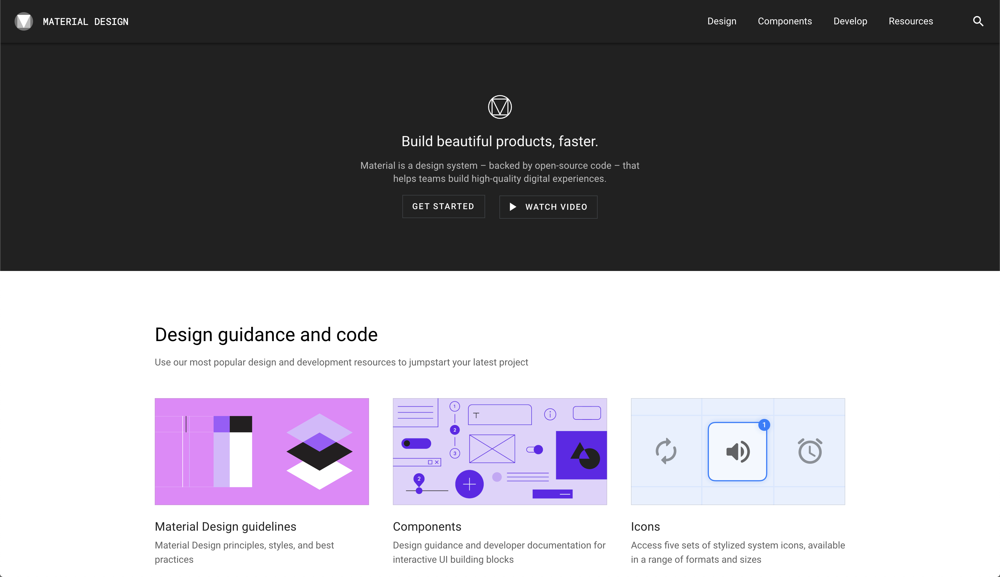

---
title:
  'Quicker and Less Stressful Note-Taking: The Workshop and the
  Storefront'
date: '2020-02-16'
type: 'post'
---

Cross-pollinating ideas between disciplines can be an endless source
of creativity. Recently, I took inspiration from my work of building
user interfaces to think about how I construct my note-taking systems.

The source of inspiration was
[Brad Frost’s “The Workshop and the Storefront”.](https://bradfrost.com/blog/post/the-workshop-and-the-storefront/)
When making user interfaces, Frost advocates separating what you build
into two distinct groups.

The first group, the Workshop, is a messy construction laboratory. The
Workshop is a place to help you _create_. For app-building in 2020,
this means using something like [Storybook](https://storybook.js.org/)
to help you quickly create reusable buttons, drop-downs, date-pickers
and other components.

The second group is the Storefront, the place where you present your
work in a pristine manner for consumption and hide the blemishes
formed in your work’s construction from view. For UIs, these take the
form of Style Guides ([Material](https://material.io/),
[GDS](https://design-system.service.gov.uk/) and
[Primer](https://styleguide.github.com/primer/support/typography/) are
my favourites).

## Workshops and Storefronts for Note-Taking

Transferring this model to my note-taking systems has been hugely
productive. For me, the primary way the distinction manifests itself
is between the usage of
[Notion](https://www.notion.so/?r=89c09b9c7d60434392c2bf154fbebb99)
and [Evernote](https://evernote.com/).

Evernote is my Workshop. I dump almost anything in there: articles,
web highlights, book notes, meeting notes, quick thoughts. Evernote’s
easy input methods[^1] facilitate effortless creation, just as a good
Workshop should and, weirdly, Evernote’s poor feature set for
formatting and organising notes means I am encouraged not to waste
time tidying things up.

Notion, on the other hand, is an app you can _create_ in. In many
ways, it is a fully-fledged app builder, not a mere markdown file
repository, and it has a feature set that means I can present my ideas
in a much more fluid and expressive manner. Once a Workshop idea I
like has become fully-formed, I put it in a digestible and usable
format in my Notion Storefront. This means I save my energy only for
what matters most, carefully selecting from my Workshop as I see fit.

### The Workshop ↔ Storefront Spectrum

The division works just as well as a spectrum as it does a hard
binary. A gradual iteration from Workshop to Storefront lowers the
barrier to getting started and means your notes get refined on an
as-need basis, keeping the process lean.[^2] Working this way is less
stressful too, and it helps me counter my sometimes perfectionist
tendencies.

When writing and refactoring software[^3], an excellent approach is
Kent Beck’s “Make it work, make it right, make it fast”. Analogously,
for note-taking, first, you do _something_ to get your ideas down.
Then, you tidy them up. Finally, you put the information in the most
usable format possible.

### Examples of Workshops and Storefronts

So, what does this model look like concretely?

The first example I’ll walk through is the construction of my
decision-making journal in Notion.

I first got interested in the topic of decision making when studying
decision theory at university. Around this point, I started loosely
collecting highlights from various blog posts and books in my
‘Decision-Making’ Evernote notebook. Initially, I would refer to these
resources when it came time to make an important decision. After doing
this several times, I began to formalise the process in a Notion
template (see above screenshot), so that it became more streamlined.
If you’ve read
[my post on how I stay productive](/cascading-productivity-system/),
my goals system was built in a similarly.

An example of a more iterative workflow would be my reading list which
started as just bullet-points. After I started adding information to
the books, the page evolved into a toggle list so I could show and
hide the extra information as needed. The toggles, too soon became
unmanageable, and I converted to a fully-fledged database. About
eighteen months in, I can search by category, read status, ownership,
rating and more. The list is still evolving, and I’m excited to see
where it goes next.

My idea here is only a model, and
[all models are wrong](https://en.wikipedia.org/wiki/All_models_are_wrong).
However, I’ve found it to be a useful one and I hope it can be for you
too.

---

#### Edit: Talk Available

I gave a version of this blog post as a talk during a
[Building a Second Brain Meetup](https://www.eventbrite.co.uk/e/3-second-brain-meetup-london-tickets-90751858251).
[Maggie Appleton](https://maggieappleton.com/) was kind enough to
record the talk so if you'd rather consume this in video form head
over to
[the talk on YouTube here](https://www.youtube.com/watch?v=WWWRmDjxSRw).

[^1]:

  My favourite input methods are [Instapaper](http://instapaper.com/)
  highlights via [Readwise](https://readwise.io/i/james522),
  Evernote’s native extension,
  [Scanner Pro,](https://readdle.com/scannerpro) and the
  [Spark](https://sparkmailapp.com/) email client.

[^2]:

  See
  [Tiago Forte’s Progressive Summarisation](https://praxis.fortelabs.co/progressive-summarization-a-practical-technique-for-designing-discoverable-notes-3459b257d3eb/)for
  a note-taking method that works in this way.

[^3]:

  Refactoring is the process of improving software without changing
  its underlying behaviour
